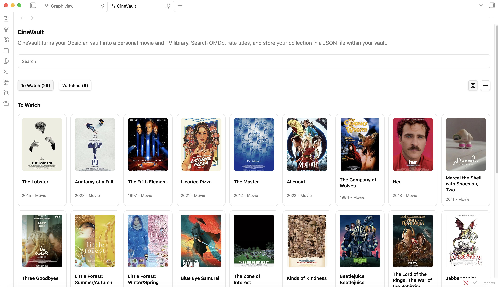
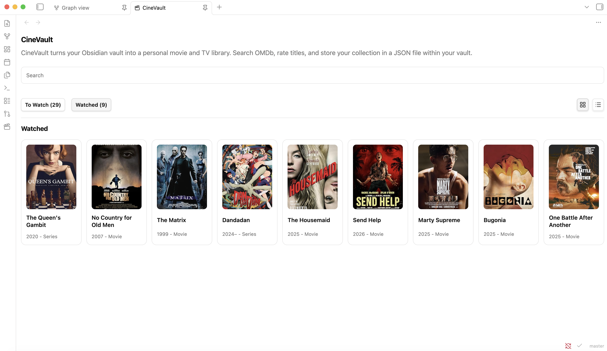
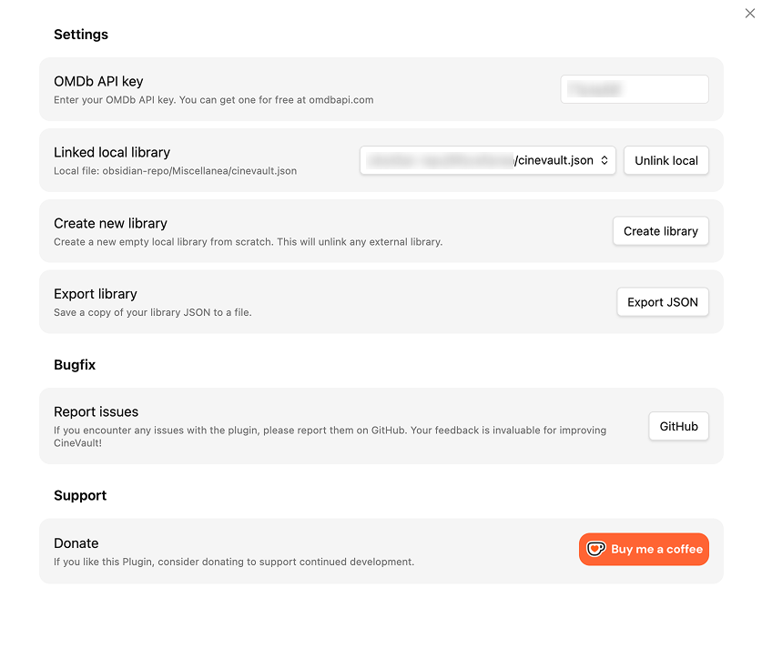

# CineVault
#### Obsidian Movie Library Plugin

CineVault is a comprehensive Obsidian plugin that transforms your vault into a personal movie and TV series management system. It seamlessly integrates with the OMDb API to help you search, catalog, and organize your movie collection and watchlist directly within Obsidian.

Note: CineVault depends on the OMDb API for search and detailed movie data. You must register at https://www.omdbapi.com/ and obtain an API key to use the search and details features.

### Features

- Search movies/series via OMDb and fetch full details (plot, poster, ratings).
- Maintain a local library with watch status and personal star ratings.
- Fast add/remove movies from search results with full metadata sync.
- Local or linked-vault JSON storage (works on mobile).
- In-vault export of your library (creates timestamped JSON file inside the vault).
- Clean, responsive UI with grid/list views and compact detail modals.

### Demo
https://github.com/user-attachments/assets/ce3c88a8-33aa-4486-84ed-3cfffb52b197

### Screenshots

Application
<p align="center">
    
    
</p>

Settings
<p align="center">
    
</p>

1. Download the latest release from the releases page
2. Extract the files into your vault's `.obsidian/plugins/obsidian-cinevault/` directory
3. Reload Obsidian
4. Enable the plugin in Settings → Community Plugins

#### Development Setup

```bash
# Install dependencies
npm install

# Start development mode with hot reload
npm run dev

# Build for production
npm run build
```

### Configuration

#### OMDb API Key

To use the search functionality, you need an OMDb API key:

1. Get an API key from [OMDb API](https://www.omdbapi.com/apikey.aspx)
2. Open Obsidian Settings → CineVault
3. Enter your API key in the "OMDb API Key" field

The plugin includes a default demo API key for testing purposes, but it's recommended to use your own key for production use.

#### Library Storage Options

CineVault offers two storage methods:

- **Local Storage**: Data is stored in `cinevault-json/cinevault.json` within your vault
- **External Storage**: Connect to an external JSON file outside your vault for portability

### Usage

#### Getting Started

1. Click the clapperboard icon in the ribbon to open CineVault
2. On first launch, choose to create a new library or connect an existing one
3. Start searching for movies and building your collection!

#### Adding Movies

1. Type a movie title in the search bar
2. Click on a search result to view details
3. Choose "Segna come visto" (Mark as watched) or "Da vedere" (To watch)
4. The movie will be added to your library with full details from OMDb

#### Managing Your Library

- **View Details**: Click on any movie card to see full information
- **Rate Movies**: Use the star rating system in the detail modal
- **Toggle Status**: Move movies between "To Watch" and "Watched" lists
- **Remove Movies**: Delete movies from your library via the detail modal

### Project Structure

```
src/
├── main.ts                    # Plugin entry point and settings
├── constants.ts               # Application constants
├── utils.ts                   # Utility functions
├── types/
│   └── cinevault.ts          # TypeScript type definitions
├── services/
│   ├── libraryStorage.ts     # Data persistence layer
│   └── omdbService.ts        # OMDb API integration
├── ui/
│   ├── onboarding.ts         # First-time setup UI
│   ├── starRating.ts         # Star rating component
│   └── modals/
│       ├── CineVaultMovieActionModal.ts  # Add movie modal
│       └── CineVaultMovieDetailModal.ts  # Movie details modal
└── views/
    └── CineVaultView.ts      # Main plugin view
```

### Technical Documentation

Detailed technical documentation has been moved to [TECHNICAL.md](TECHNICAL.md).
Please open that file for architecture details, data models, services, and build information.

### API Integration

#### OMDb API

The plugin integrates with the Open Movie Database (OMDb) API:

- **Base URL**: `https://www.omdbapi.com/`
- **Search Endpoint**: `?apikey={key}&s={query}`
- **Details Endpoint**: `?apikey={key}&i={imdbId}&plot=full&tomatoes=true`

### Contributing

Contributions are welcome! Please ensure:

1. Code follows the existing style and patterns
2. TypeScript types are properly defined
3. Changes are tested in development mode
4. Documentation is updated accordingly

### License

MIT License - See [LICENSE](LICENSE) file for details

### Author

**Vittorio Scaperrotta**
- Website: [vittorioscaperrotta.me](https://vittorioscaperrotta.me/)

### Bugs and Issues

For issues, feature requests, or questions, please open an issue on the project repository.

### Support

If you like this Plugin, consider donating to support continued development.

<a href='https://ko-fi.com/vittorioscaperrotta' target='_blank'></a>

---

**Version**: 1.0.0
**Minimum Obsidian Version**: 0.15.0
